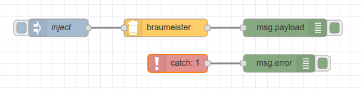

# Node-RED Braumeister

Basic [Node-RED](https://nodered.org) nodes for interacting with Speidels Braumeister homebrewing system. When a BRAUMEISTERmobil WiFi module is installed, it is running a web server with a rudimentary API. It provides measurement data like temperature or pump status as well as a list of stored recipes.

## &#x1F534; This doesn't work with the newest Braumeister firmware 1.1.27 &#x1F534;

## Requirements

- Braumeister brewing equipment with firmware earlier than 1.1.27
- BRAUMEISTERmobil WiFi extension module
- Node-RED

## braumeister node


This node does an HTTP request to the Braumeister's `/bm.txt` file. The response is a txt file containing a csv-like string:

```
"V1.1.27 Sep 12 2018;0004A30B003FA809;0X13:13XCX2930X0X 72.5X0X2234X1X1X5X0X191XA00SXpiX000X0X0X0"
```

(See [/bm.txt](docs/bm.txt.md) for more details what these values stand for.)

This node converts this string into an object containing measurement data / status values.

| value                 | description                                     |
| --------------------- | ----------------------------------------------- |
| `firmware_version`    | Braumeister firmware version                    |
| `temperature_current` | current temperature in °C                       |
| `temperature_target`  | target temperature in °C                        |
| `time_target`         | target time in seconds                          |
| `time_elapsed`        | elapsed time in seconds                         |
| `pump`                | pump status: `"off"`, `"on"` or `"inactive"`    |
| `heating`             | heating status: `"off"`, `"on"` or `"inactive"` |
| `source_string`       | raw source string                               |

#### Example Usage



## recipes node


This node does an HTTP request to the Braumeister's `/rz.txt` file, parses the recipes and returns them in an array of objects:

```
[
  {
      index: 0,
      mesh_in_temperature: 45,
      step_1_temperature: 50,
      step_1_time: 15,
      step_2_temperature: 60,
      step_2_time: 20,
      step_3_temperature: 70,
      step_3_time: 15,
      step_4_temperature: 75,
      step_4_time: 5,
      boiling_time: 30,
      boiling_temperature: 100,
      hop_1_time: 5,
      hop_2_time: 10,
      hop_3_time: 15,
      hop_4_time: 0,
      hop_5_time: 0,
      hop_6_time: 0,
      beer_name: "Doubly Hoeppi"
    },
    {...}
]
```

## Contributions

Contributions are always welcome! I need help further decrypting the [/bm.txt](docs/bm.txt.md) response file.
